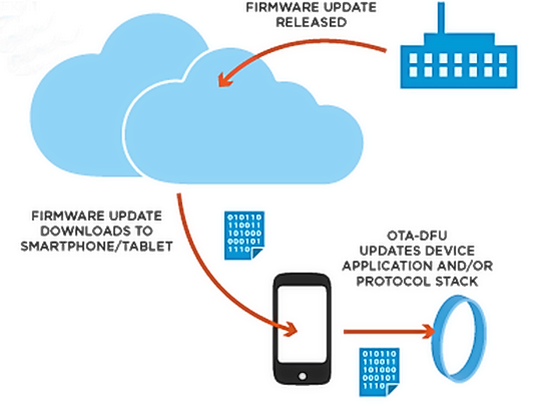

# DFU Library

[  ](https://bintray.com/nordic/android/dfu-library/_latestVersion)

### Usage

The compat library may be found on jcenter and Maven Central repository. Add it to your project by adding the following dependency:

```Groovy
compile 'no.nordicsemi.android:dfu:1.0.0'
```

If you use proguard, add the following line to your proguard rules:
```-keep class no.nordicsemi.android.dfu.** { *; }```

### Device Firmware Update (DFU)

The nRF5x Series chips are flash-based SoCs, and as such they represent the most flexible solution available. A key feature of the nRF5x Series and their associated software architecture
and S-Series SoftDevices is the possibility for Over-The-Air Device Firmware Upgrade (OTA-DFU). See Figure 1. OTA-DFU allows firmware upgrades to be issued and downloaded to products 
in the field via the cloud and so enables OEMs to fix bugs and introduce new features to products that are already out on the market. 
This brings added security and flexibility to product development when using the nRF5x Series SoCs.



This repository contains a tested library for Android 4.3+ platform which may be used to perform Device Firmware Update on the nRF5x device using a phone or a tablet.

DFU library has been designed to make it very easy to include these devices into your application. It is compatible with all Bootloader/DFU versions.

[](http://youtu.be/LdY2m_bZTgE)

### Documentation

See the [documentation](documentation) for more information.

### Requirements

The library is compatible with nRF51 and nRF52 devices with S-Series Soft Device and the DFU Bootloader flashed on. 

### DFU History

* **SDK 4.3.0** - First version of DFU over Bluetooth Smart. DFU supports Application update.
* **SDK 6.0.0** - DFU Bootloader supports Soft Device and Bootloader update. As the updated Bootloader may be dependent on the new Soft Device, those two may be sent and installed together.
* **SDK 6.1.0** - Buttonless update support for non-bonded devices.
* **SDK 7.0.0** - The extended init packet is required. The init packet contains additional validation information: device type and revision, application version, compatible Soft Devices and the firmware CRC.
* **SDK 8.0.0** - The bond information may be preserved after an application update. The new application, when first started, will send the Service Change indication to the phone to refresh the services.
    - Buttonless update support for bonded devices - sharing the LTK between an app and the bootloader.
* **SDK 12.0.0** - New Secure DFU has been released. This library is fully backwards compatible so supports both the new and legacy DFU.

Check platform folders for mode details about compatibility for each library.

### Resources

- [DFU Introduction](http://infocenter.nordicsemi.com/topic/com.nordic.infocenter.sdk5.v11.0.0/examples_ble_dfu.html?cp=6_0_0_4_3_1 "BLE Bootloader/DFU")
- [How to create init packet](https://github.com/NordicSemiconductor/Android-nRF-Connect/tree/master/init%20packet%20handling "Init packet handling")
- [nRF51 Development Kit (DK)](http://www.nordicsemi.com/eng/Products/nRF51-DK "nRF51 DK") (compatible with Arduino Uno Revision 3)
- [nRF52 Development Kit (DK)](http://www.nordicsemi.com/eng/Products/Bluetooth-Smart-Bluetooth-low-energy/nRF52-DK "nRF52 DK") (compatible with Arduino Uno Revision 3)
